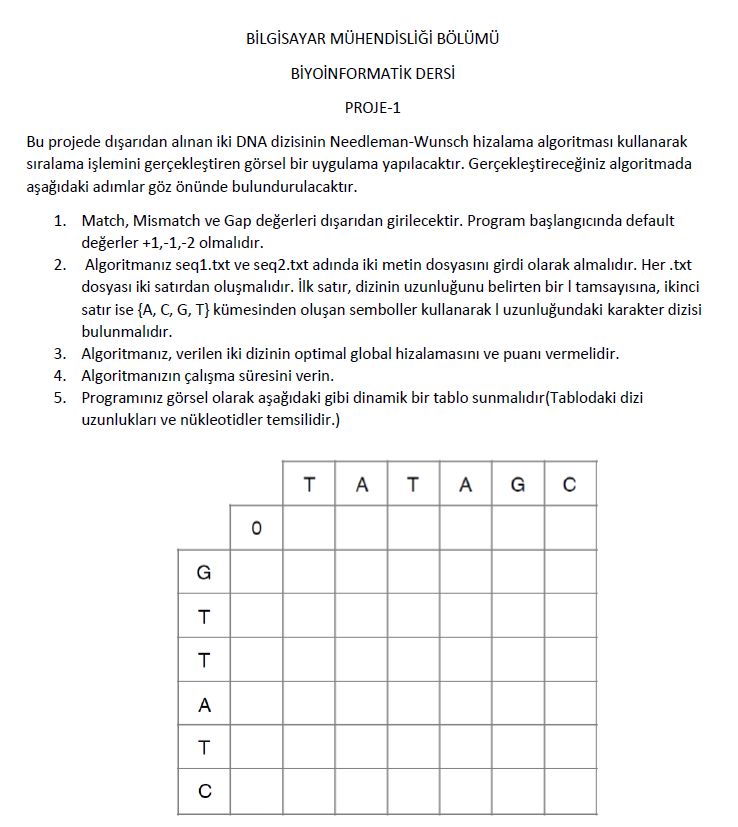
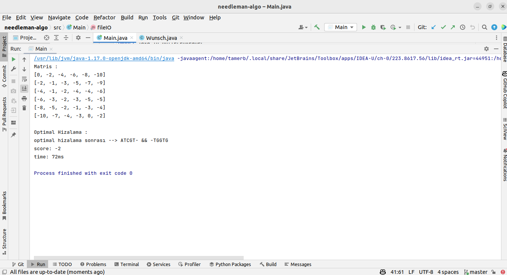

<h1>Proje</h1>


### !!! GÖRSEL ARAYÜZ İÇİN -->   https://github.com/mtamerb/needleman-wunsch-app-gui

### !!! Bilgisayarınızda java kurulu ise ; Linkten app.jar  dosyasını indirip, terminalde dosyanın bulunduğu yola gidip 

jar file : https://drive.google.com/file/d/1o2G0KPueu6BuQZ-tLPag5GxZoFjcj4Do/view?usp=sharing

```bash
  java -jar java-gui-app.jar
```


-- komutu ile programı kullanabilirsiniz...   </h2>




<h1>Çıktı</h1>




<h1>Kullanım</h1>

Projeyi klonlayın

```
git clone https://github.com/mtamerb/needleman-algo.git

```
<p>Ardından IDE vs. gerekli ayarları tamamlayın .</p>

<p>.sonrasında /resources/files klasörü içersindeki text dosyalarında nükleotid dizininde değişiklikler yapıp kullanın. </p>
